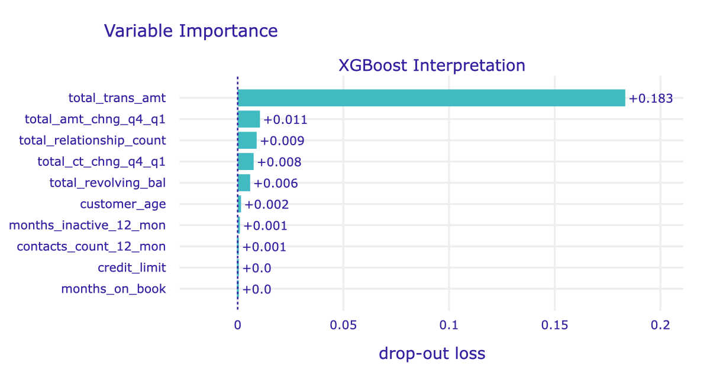

# Bank Churn Classification Model 💸💸

## Project Background

Customer churn is a critical issue for businesses, especially in the banking sector, where retaining clients is essential for sustainable growth. By analyzing customer behaviors and attributes, organizations can proactively identify those likely to churn and implement strategies to enhance retention.

## Problem Statement

This repository contains a comprehensive analysis of customer churn prediction using machine learning models. The project aims to identify key factors influencing customer attrition and to develop predictive models that can help mitigate churn rates in a financial services context.

## Goals

- To uncover patterns in customer and demographics.
- To analyze customer data to predict churn rates and identify factors leading to attrition.
- To develop a predictive model to identify at-risk customers.

## Objective

To inform of targeted retention strategies, thus enhancing customer engagement and reduce churn rates.

## Dataset

The dataset used for this project is a dummy [Bank Churn Dataset](https://raw.githubusercontent.com/hadimaster65555/dataset_for_teaching/main/dataset/bank_churn_dataset/bank_churn_data.csv)

## Data Dictionary

- **user_id:** Customer account number
- **customer_age:** Age of the customer
- **gender:** Gender of customer (M for male and F for female)
- **dependent_count:** Number of dependents of customers
- **education_level:** Customer's education level (Uneducated, High School, Graduate, College, Post-Graduate, Doctorate, and Unknown)
- **marital_status:** Customer's marital status (Single, Married, Divorced, and Unknown)
- **income_category:** Customer's income interval category (Less than `$40K`, `$40K-$60k`, `$60K-$80K`, `$80K-$120K`, `$120K +`, and Unknown)
- **card_category:** Type of card used (Blue, Silver, Gold, and Platinum)
- **months_on_book:** Period of being a customer (in months)
- **total_relationship_count:** Number of products used by customers in the bank
- **months_inactive_12_mon:** Period of inactivity for the last 12 months
- **contacts_count_12_mon:** The number of interactions between the bank and the customer in the last 12 months
- **credit_limit:** Credit card transaction nominal limit in one period
- **total_revolving_bal:** Total funds used in one period
- **avg_open_to_buy:** The difference between the credit limit set for the cardholder's account and the current balance
- **total_amt_chng_q4_q1:** Increase in customer transaction nominal between quarter 4 and quarter 1
- **total_trans_amt:** Total nominal transaction in the last 12 months
- **total_trans_ct:** The number of transactions in the last 12 months
- **total_ct_chng_q4_q1:** The number of customer transactions increased between quarter 4 and quarter 1
- **avg_utilization_ratio:** Percentage of credit card usage

## Target

- **attrition_flag:** Customer status (Existing and Attrited)

## Project Highlights

**Data Exploration and Visualization:** Conducted exploratory data analysis (EDA) to understand customer demographics, transaction behaviors, and interaction patterns.

**Feature Engineering:** Identified and engineered relevant features, including transaction amounts, customer relationships, and interaction frequency.

**Modeling:** Implemented and evaluated multiple machine learning models, including Decision Trees, Random Forest, and XGBoost, to predict customer churn.

**Feature Importance Analysis:** Utilized feature importance metrics to highlight significant predictors of churn, leading to actionable insights for business strategies.

## Exploratory Data Analysis
(Train Data Analysis)

### Distribution of Customer Age and Attrition Probability

**Insight:** The age distribution shows that most customers fall between the ages of 40 and 55. Among these, customers in the 40–50 age group exhibit a noticeably higher attrition rate compared to other age groups. Younger customers of age group 30-40 and customers of age group 50-60 also display a moderate attriting tendency, while customers below 30 years and above 60 years have a lower likelihood of leaving. This suggests that targeting retention efforts toward customers in their 40s could be effective in reducing overall attrition rates.

### Correlation Between Education Level and Income Category, and Attrition

**Insight:** Based on the analysis of the graphs, there is a weak correlation between education level and income category, as indicated by the heatmap. The customer's education level does not affect their income category. The count plots reveal that attrition rates vary across different education levels, with "Graduates" and "High School" exhibiting higher attrition rates, while "Doctorate" and "Post-Graduate" has a lower attrition rate. Similarly, the income category analysis shows that customers in lower income brackets of "Less than $40K"are more likely to churn, indicating a potential link between financial stability and customer retention. Overall, both education and income appear to play significant roles in predicting customer attrition.

### Gender and Attrition Probability

**Insight:** The analysis of customer attrition by gender reveals that there is a noticeable difference in the likelihood of attrition between male and female customers. The frequency of attrition is higher among females compared to males - female customers demonstrates a greater tendency to churn. Therefore, targeted strategies may be needed to address the factors influencing female customer attrition and enhance retention efforts.

### Customer Tenure and Attrition Probability

**Insight:** The histogram shows customers in the 30-40 month range have the highest frequency of attrition. There is a noticeable decline in churn rates for those who have been customers for more than 40 months or less than 30 months. This suggests that although some customers may leave after a few years, long-term customers exhibit lower attrition rates, indicating that longer engagement may foster loyalty. Understanding the factors influencing a within the initial years could help the bank improve retention strategies and enhance customer loyalty over time.

### Interaction Frequency and Attrition Probability

**Insight:** The boxplot shows a substantial difference in contact frequency between attrited and existing customers. Existing customers have a notably higher median and overall range of contact counts, suggesting that more frequent interactions may help maintain customer loyalty. In contrast, attrited customers exhibit a much lower average interaction count, indicating that less engagement could be a strong indicator of potential attrition. This trend suggests that encouraging regular touchpoints or increasing engagement opportunities with lower-contact customers may help reduce attrition rates.

## Data Pre-Processing

1. Data Wrangling involved data cleaning such as fixing data quality (types, duplicates, and missing). However, there were no duplicated or missing data in the data dummy.
3. Feature Selection and Engineering involved:
- Encoding the categorical variables (`attrition_flag` (target), `gender`, `marital_status`)
2. The data was then split into 80% train: 20% test ratio for modelling
3. The train dataset were also checked:
- Outliers were removed using log transformation.
- Multicollinearity were checked between the variables (The `avg_open_to_buy` and `credit_limit` columns are highly correlated (>0.8), and so are `total_trans_amt` and `total_trans_ct`. The `avg_open_to_buy` and  `total_trans_ct` columns were dropped.)

## Model Selection and Analysis

To figure out which model is the best, we will create three different models and evaluate:
- Decision Tree (base model)
- Random Forest
- XGBoost

- The Decision Tree model performs well with positive F1-score of 100% on train data and 95.26% on test data, showing decent precision and recall for both classes but slightly lower precision and recall, and signs of overfitting.
- The Random Forest model has an F1-score of 100% on the train data and 96.74% on the test data with higher precision for both classes, but lower recall for the negative class compared to Decision Tree.
- XGBoost reaches an F1-score of 99.99% on train data and 97.83% on test data, with the highest precision and recall for both classes, and more generalizable model.

In summary, **XGBoost** is the best-performing model overall due to its superior accuracy and balanced performance across precision, recall, and F1 scores. This makes XGBoost the most reliable model for identifying customer churn, as it minimizes both false positives and false negatives.

## Features Importances

The `total_trans_amt` (total nominal transaction in the last 12 months) column is the most significant predictor of customer churn, indicating a strong positive influence where higher transaction amounts may correlate with lower attrition rates. While those with a score of +0.008 and +0.006 suggests that they have a limited effect on distinguishing between churned and existing customers. Other features with scores of contribute negligibly to the attrition prediction model, suggesting they may be less relevant for analysis.

### Partial Dependence Plot

The Partial Dependence Plot shows that `customer_age`, `dependent_count`, `education_level`, `income_category`, `card_category`, `months_on_book`, `months_inactive_12_mon`, `credit_limit`, and `avg_utilization_ratio` variables have no effect on the rate of attrition. Whereas `total_relationship_count`, `contacts_count_12_mon`, and `total_revolving_bal` did slightly effect the rate of retention.

It can be seen that the `total_trans_amt`, `total_amt_chng_q4_q1`, and `total_ct_chng_q4_q1` have the highest effect on customer attrition. It is recommended to consider implementing strategies that encourage higher transaction volumes, which could include offering incentives for larger purchases or promoting bundled services that increase transaction values. Thus, enhancing customer relationships through personalized services or loyalty programs which could lead to higher retention rates.

## Key Findings

1. The Total Nominal Transaction in the Last 12 Months is the most significant predictor of churn, suggesting a direct correlation between transaction behavior and customer retention.
2. The Number of Products Used by Customers also plays a vital role in predicting churn, indicating that fostering strong customer relationships can enhance retention efforts.
3. Insights from Increase in Customer Transaction Nominal Between Q4 and Q1 and Total Funds Used in One Period indicate that managing customer balances and spending patterns can significantly affect churn likelihood.
4. The analysis of customer demographics and interaction frequency reveals opportunities for targeted marketing and personalized engagement strategies to improve customer loyalty.

## Recommendations

- Implement strategies to increase customer engagement, especially for those with lower transaction amounts.
- Focus on enhancing customer service and relationship management practices to build stronger connections with customers.
- Utilize the predictive model to identify at-risk customers proactively and apply retention tactics tailored to their behaviors.

## Thank You 🙌
